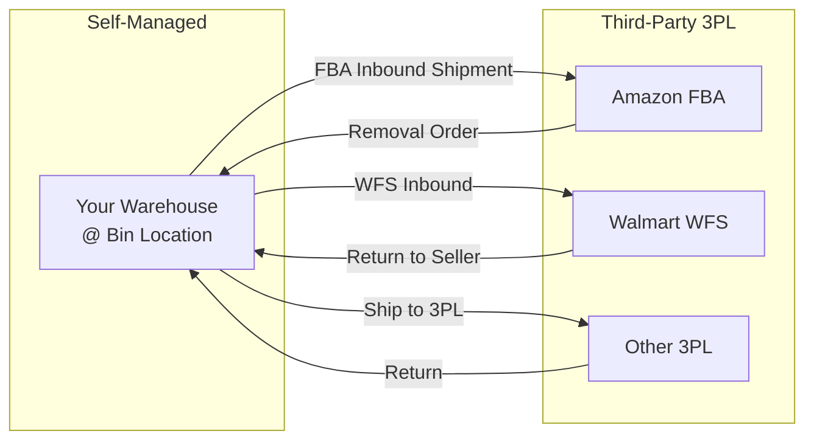
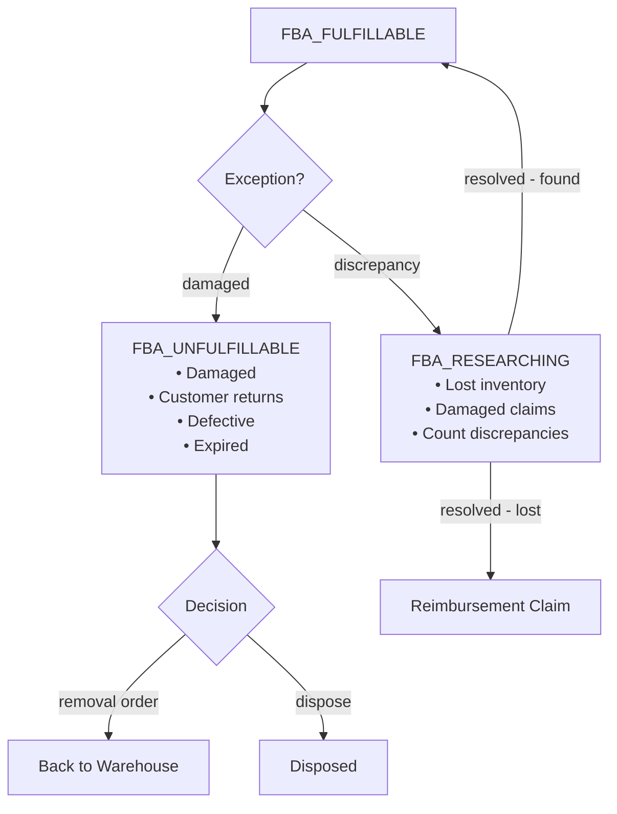
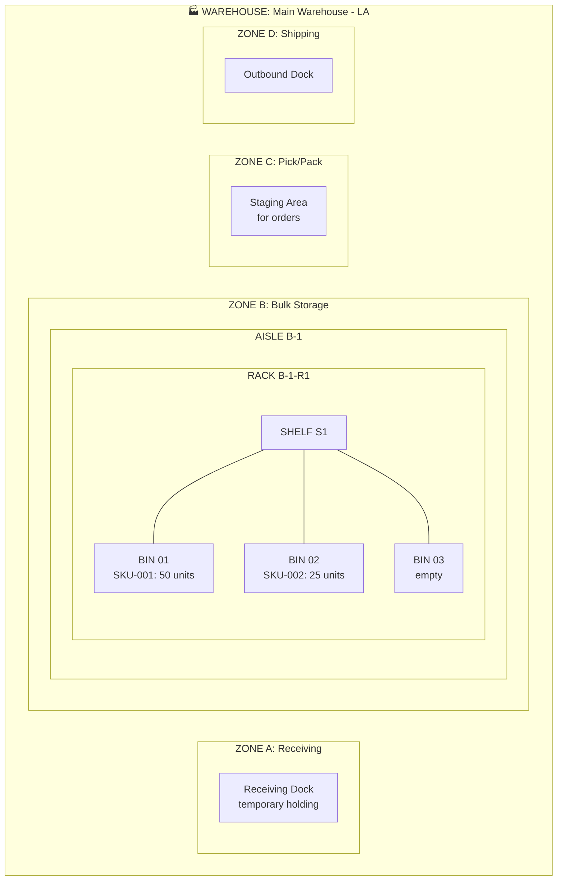
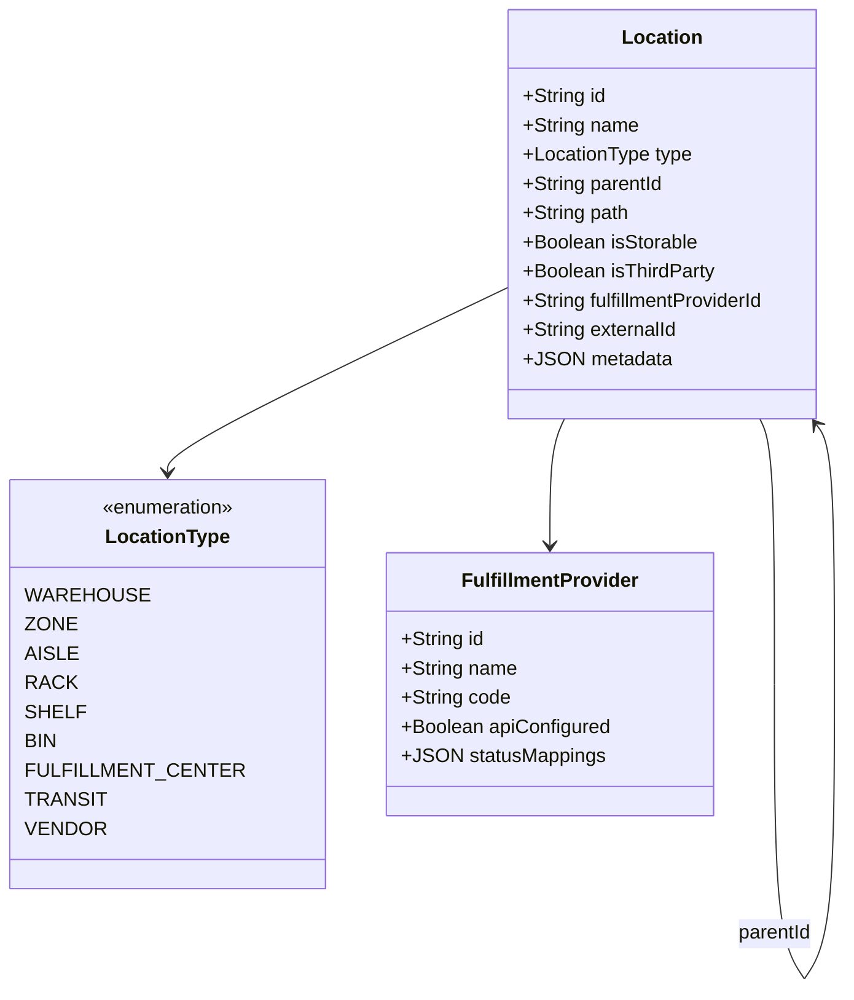
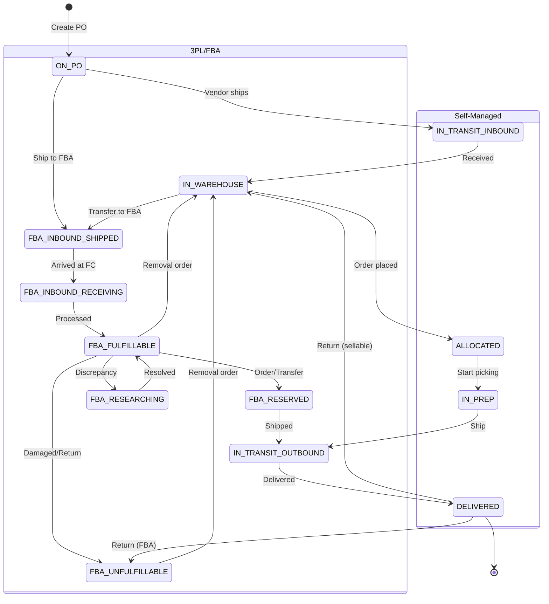
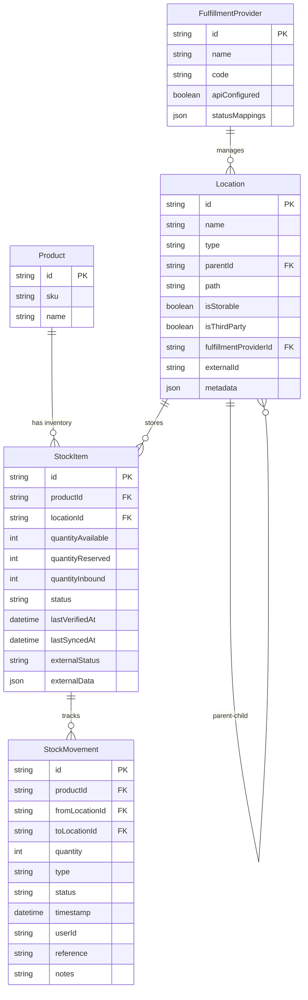
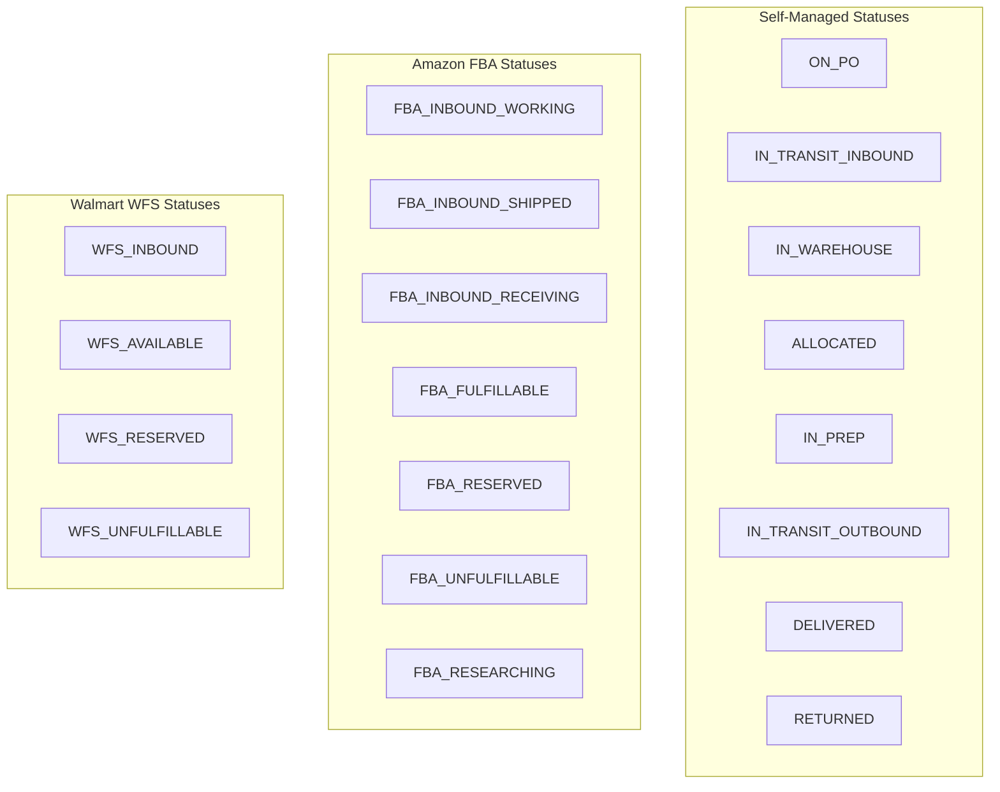

# Inventory Flow & Location Management

This document defines the complete inventory lifecycle, location hierarchy, and tracking requirements for Copio.

## Inventory Lifecycle Overview

```mermaid
flowchart TB
    subgraph PO["📋 PURCHASE ORDER"]
        ON_PO[ON_PO<br/>Ordered, not shipped]
    end

    ON_PO -->|vendor ships| SPLIT{Ship Destination?}
    
    SPLIT -->|to your warehouse| SELF_PATH
    SPLIT -->|direct to 3PL| FBA_PATH

    subgraph SELF_PATH["🏭 SELF-MANAGED PATH"]
        IN_TRANSIT_IN[IN_TRANSIT_INBOUND<br/>From vendor]
        IN_WAREHOUSE_RECV[IN_WAREHOUSE<br/>At dock/receiving]
        IN_WAREHOUSE_BIN[IN_WAREHOUSE<br/>@ Zone/Aisle/Bin<br/>lastVerifiedAt]
        ALLOCATED[ALLOCATED<br/>Reserved for order]
        IN_PREP[IN_PREP<br/>Pick/pack/label]
        IN_TRANSIT_OUT_SELF[IN_TRANSIT_OUTBOUND<br/>To customer]

        IN_TRANSIT_IN -->|arrive| IN_WAREHOUSE_RECV
        IN_WAREHOUSE_RECV -->|put away| IN_WAREHOUSE_BIN
        IN_WAREHOUSE_BIN -->|customer order| ALLOCATED
        ALLOCATED -->|picking| IN_PREP
        IN_PREP -->|ship| IN_TRANSIT_OUT_SELF
    end

    subgraph FBA_PATH["📦 3PL/FBA PATH"]
        FBA_INBOUND_SHIPPED[FBA_INBOUND_SHIPPED<br/>To Amazon FC]
        FBA_INBOUND_RECV[FBA_INBOUND_RECEIVING<br/>Being processed]
        FBA_FULFILLABLE[FBA_FULFILLABLE<br/>Sellable on AMZ<br/>lastSyncedAt]
        FBA_RESERVED[FBA_RESERVED<br/>Picking/packing or<br/>FC transfer]
        IN_TRANSIT_OUT_FBA[IN_TRANSIT_OUTBOUND<br/>AMZ shipping]

        FBA_INBOUND_SHIPPED -->|arrive at FC| FBA_INBOUND_RECV
        FBA_INBOUND_RECV -->|processed| FBA_FULFILLABLE
        FBA_FULFILLABLE -->|AMZ order| FBA_RESERVED
        FBA_RESERVED -->|shipped| IN_TRANSIT_OUT_FBA
    end

    IN_TRANSIT_OUT_SELF --> DELIVERED[✅ DELIVERED]
    IN_TRANSIT_OUT_FBA --> DELIVERED

    DELIVERED -->|return?| RETURNED[RETURNED]
    RETURNED -->|sellable| FBA_FULFILLABLE
    RETURNED -->|sellable| IN_WAREHOUSE_BIN

    %% Transfers
    IN_WAREHOUSE_BIN <-->|transfer to/from FBA| FBA_FULFILLABLE
```

## Transfer Between Locations



## 3PL Exception States



## Warehouse Location Hierarchy



## Location Type Hierarchy



## Inventory Status State Machine



## Data Model



## Inventory Status Enum



## Product Inventory View (UI Wireframe)

```
┌─────────────────────────────────────────────────────────────────────────────┐
│  PRODUCT: Widget Pro X (SKU: WPX-001)                                       │
│  ════════════════════════════════════                                       │
│                                                                             │
│  📦 TOTAL INVENTORY: 342 units                                              │
│  ├── Fulfillable: 285                                                       │
│  ├── Reserved: 12                                                           │
│  ├── Inbound: 45                                                            │
│  └── Unfulfillable: 0                                                       │
│                                                                             │
├─────────────────────────────────────────────────────────────────────────────┤
│  LOCATION                    │ QTY  │ STATUS          │ LAST VERIFIED       │
│  ────────────────────────────┼──────┼─────────────────┼─────────────────    │
│  📍 Main Warehouse - LA      │      │                 │                     │
│     └─ B-1-R1-S1-01          │  50  │ ✅ In Stock     │ Jan 30, 2:15 PM     │
│     └─ B-1-R2-S3-08          │  35  │ ✅ In Stock     │ Jan 29, 9:00 AM     │
│     └─ C-1 (Pick Area)       │  12  │ 📦 Allocated    │ Jan 30, 1:45 PM     │
│                              │      │                 │                     │
│  🏭 Amazon FBA (US)          │      │                 │                     │
│     └─ PHX7 (Phoenix FC)     │ 120  │ ✅ Fulfillable  │ Synced: 10 min ago  │
│     └─ ONT8 (California FC)  │  80  │ ✅ Fulfillable  │ Synced: 10 min ago  │
│     └─ (In Transit)          │  45  │ 🚚 Inbound      │ Ship date: Jan 28   │
│                              │      │                 │                     │
│  🏭 Walmart WFS              │      │                 │                     │
│     └─ (Not configured)      │  --  │ --              │ --                  │
├─────────────────────────────────────────────────────────────────────────────┤
│  📋 RECENT MOVEMENTS                                                        │
│  ────────────────────────────────────────────────────────────               │
│  Jan 30, 2:15 PM │ VERIFY   │ B-1-R1-S1-01      │ Cycle count: 50 units    │
│  Jan 30, 1:45 PM │ ALLOCATE │ B-1-R1-S1-01 → C-1│ Order #1234 (12 units)   │
│  Jan 28, 9:00 AM │ SHIP_FBA │ Warehouse → PHX7  │ FBA Shipment #ABC123     │
│  Jan 25, 3:30 PM │ RECEIVE  │ PO-2025-018       │ +100 units from vendor   │
└─────────────────────────────────────────────────────────────────────────────┘
```

## Implementation Phases

### Phase 1: Location Hierarchy
- Update Location model with `parentId`, `path`, `type`
- Location CRUD with parent selection
- Location tree view (collapsible hierarchy)
- Seed example warehouse structure

### Phase 2: Inventory Status Tracking
- Add `status` and `lastVerifiedAt` to StockItem
- Create InventoryStatus enum
- Update receive PO flow to set status
- Add status badges to inventory views

### Phase 2.5: Fulfillment Provider Support
- Create FulfillmentProvider model
- Add provider selection to Location
- Define provider-specific status enums
- UI to configure providers (name, status mappings)
- Location form: toggle "Third-Party Fulfillment" mode

### Phase 3: Product Inventory View
- Product detail → "Inventory" tab
- Show all locations with qty, status, last verified
- Show 3PL inventory separately grouped
- Display provider-specific statuses with tooltips

### Phase 4: Movement History
- Enhanced StockMovement with from/to locations
- Movement log page (filterable by product, location, date)
- Quick actions: Transfer, Adjust, Verify

### Phase 5: Warehouse Bin Management
- UI to define custom bin structure
- Assign inventory to specific bins
- Bin label printing (future)

### Phase 6: Marketplace Sync (Future)
- Amazon SP-API: Pull FBA inventory
- Walmart API: Pull WFS inventory
- Auto-sync on schedule
- Reconciliation alerts
